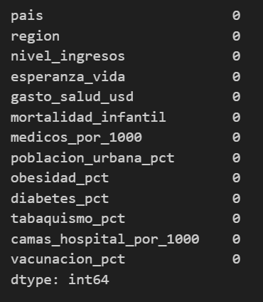

# Taller Módulo 1 — Salud Mundial🌎 **Autor:** Claudia Patricia Patiño Jaimes **Máster:** IA & Data Science —

DevSeniorCode 

## Descripción [Describe brevemente qué hace este proyecto y qué datos analiza] 

Desarrollo del taller integrador del Modulo 1 de lo visto en clase de Master IA en donde pude trabajar con un dataset con datos reales en lenguaje Python uso de libreria de pandas y repositorio de GitHub

Para el analisis de los datos se hicieron filtros de las diferentes columnas arrojando datos estadisticos de problematicas en la poblacion como la salud, tasas de mortalidad, medicos, esperanza de vida entre otros. 

## Dataset [Explica qué contiene el dataset: cuántos países, qué columnas,qué representa] 

El Data Set contiene informacion de 159 paises y 13 columnas que representan indicadores de salud que sirven para analizar estas problematicas de cada pais y region en el mundo.

COLUMNAS 

## Cómo ejecutar 

1. Clona el repositorio: `git clone [url]` 
2. Instala dependencias: `pip install pandas jupyter` 
3. Ejecuta: `jupyter notebook taller_modulo1.ipynb` 

## Hallazgos principales - Hallazgo 1: ... - Hallazgo 2: ... - Hallazgo 3: ... 

## Tecnologías Python · Pandas · Jupyter Notebook · Git · GitHub